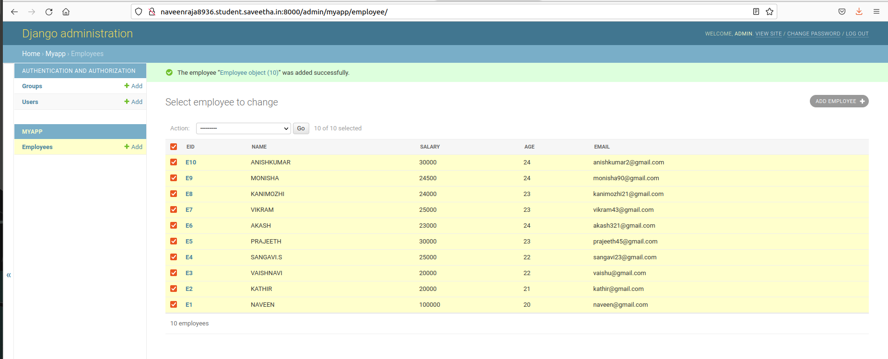

# Django ORM Web Application

## AIM
To develop a Django application to store and retrieve data from a database using Object Relational Mapping(ORM)

## DESIGN STEPS

### STEP 1:
create the django domain
### STEP 2:

then from the the django.db import the models and then from the django.contribute import the admin
### STEP 3:

then create your own model by defining the class and with the respective comments

## PROGRAM
```
Model.py
from django.db import models
from django.contrib import admin 
class Employee(models.Model):
 eid=models.CharField(max_length=20,help_text="Employee ID")
 name=models.CharField(max_length=100)
 salary=models.IntegerField()
 age=models.IntegerField()
 email=models.EmailField()
class EmployeeAdmin(admin.ModelAdmin):
 list_display=('eid','name','salary','age','email')
Admin.py
from django.contrib import admin
from.models import Employee,EmployeeAdmin
admin.site.register(Employee,       EmployeeAdmin)
```
## OUTPUT




## RESULT
The Program is executed successfully